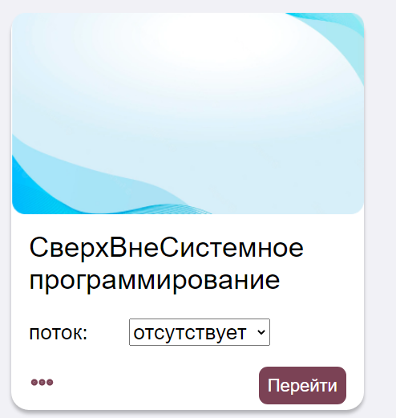

# Тестирование приложения

При открытии нашего сайта мы сразу попадаем на его главную страницу (рис. 1), где можем ознакомиться с основной информацией по Вузу и посетить интересующие нас интернет-ресурсы, перейдя по ссылкам в подвале и в шапке сайта.

 
*Рисунок 1 – Главная страница сайта Дистанционного образования*

При желании мы можем зарегистрироваться. Однако сейчас попробуем произвести авторизацию пользователя (рис. 2).

 
*Рисунок 2 – Авторизация пользователя*

В случае неправильно введенных данных будет отображаться окно с предупреждением. (рис. 3)

 
*Рисунок 3 – Информационное окно*

В случае успешной авторизации будет произведен вход на главную страницу учетной записи Преподавателя (рис. 4).

 
*Рисунок 4 – Главная страница пользователя*

При желании можно зайти в профиль преподавателя (рис. 5), его дисциплины (рис. 6) или журналы (рис. 7) с целью их редактирования.

 
*Рисунок 5 – Профиль пользователя*

 
*Рисунок 6 – Все дисциплины пользователя*

 
*Рисунок 7 – Страница журналов преподавателя*

Для примера можно выполнить редактирование дисциплины чтобы удостовериться в том, что все работает правильно. Порядок действий при редактировании дисциплины показан на рисунках с рис. 8 по рис. 11.

 
*Рисунок 8 – Процесс изменения дисциплины*

 
*Рисунок 9 – Изменение названия*

 
*Рисунок 10 – Подтверждение о изменение*

 
*Рисунок 11 – Вывод изменённой дисциплины на экран*

Для просмотра журнала пользователь должен выбрать необходимую дисциплину на странице журналов, а после, на странице журнала конкретной дисциплины при помощи фильтров выбрать нужный журнал (рис. 12 – 14).

 
*Рисунок 12 – Выбор дисциплины на странице журналов*

 
*Рисунок 13 – Фильтрация журнала по типу*

 
*Рисунок 14 – Фильтрация журнала по потоку*

Для редактирования журнала необходимо нажать соответствующий пункт нижнего меню, после чего журнал перейдёт в режим редактирования. Сохранить изменения можно нажатием на соответствующий пункт нижнего меню (рис 15).

 
*Рисунок 15 – Редактирование журнала*